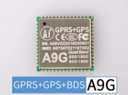

# Ai-Thinker GPRS modules- A9/A9G Libraries using [Ai-Thinker GPRS C SDK]

## Overview
This SDK provides a wrapper over the most used functionalities for the Ai-Thinker GPRS SoC modules A9/A9G making for simpler setup and faster deployability.

The A9/A9G can be used in a wide variety of IoT applications. This low-cost, effective module can be the go-to product for quick development and deployment of IoT solutions around the world. Okay okay, I'm going to stop bragging about stuff you already know and get to the point of all this conversation.

**What are we doing here?**
This is an effort to share the knowledge and experience we gained in our process of using this module with the open-source community hoping it saves time and effort to as many IoTers out there as possible.

**This brings me to talk about the drawbacks about the A9/A9G modules:**
- Scattered Documentation plus language barriers.
- AT commands do not provide anywhere near half the complete control that can be obtained on this module using the SDK.
- Development on this product has been almost completely stopped.

**How do we possible solve these?**
- This library provides an easier-to-use and ready-to-deploy, out of the box API wrapper over the GPRS_C_SDK provided by Ai-Thinker. Dont get me wrong, you will still need to use and setup the GPRS_C_SDK and setup the toolkit but we have tried to simplify it for you so you dont need to waste your precious time looking for the right links and putting the documents together(which if you keep scrolling, you'll find all the steps to get you going!).
- On top of that, we provide wrapper functions/APIs to maintain homogeneity as much as possible in your code structuring and writing.
- They also help you skip complex steps in order to get the job done with simpler, lesser code and better documentation!

Please do keep reading to know more. And since we rely on your inputs and feedback to grow and improve this project and hence the open-source community in general, please feel free to [give us feedback](## Feedback)[create issues, suggest edits and add functionalities](## Participate in the development). Dont forget to <kbd> Star </kbd> us on the top right corner of this project if you like what we are trying to achieve! 

With increasing traffic, we will come up with rigid procedures to maintain process in the same. Until then, HAVE FUN AND KEEP IoTing!

## Features

* Provides an easier-to-use and ready-to-deploy out of the box API. Integrates a wide range of features including:
  - [x] GPIO
  - [x] Power Management
  - [x] MQTT
  - [x] SPI
  - [x] I2C
  - [x] Integration with ADS1015 over I2C
  - [ ] ADC
  - [ ] GPS
  - [ ] OTA
  - [ ] Call
  - [ ] SMS
  
## Hardware

### 1. A9: GPRS Module 
(http://www.ai-thinker.com/pro_view-9.html) 

 <br>

**Datasheet of the A9 module [here](./doc/Datasheets/Ai-Thinker-A9-GPRS-Series-Module-Datasheet.pdf)**

**Features**:
  * RDA 32 bit RISC core, frequency up to 312MHz, with 4k instruction cache, 4k data cache
  * Up to 29 GPIOs (with two download pins)
  * Calendar (Real Time Clock) with alarm
  * 1 USB1.1 device interface
  * 2 UART interface with flow control (+1 download/debug serial port)
  * 2 SPI interface
  * 3 I<sup>2</sup>C interface
  * 1 SDMMC controller (interface)
  * 2 ADC interface, 10 bits
  * 32Mb (4MB) SPI NOR Flash
  * 32Mb (4MB) DDR PSRAM
  * 8kHz, 13Bits/sample ADC mic
  * 48kHz, 16bits/sample DAC Audio
  * Power Management Unit: Lithium battery charge management, integrated DC-DC and LDOs, variable IO voltage
  * 18.8 x 19.2 mm SMD package
  * Quad-band GSM/GPRS (800/900/1800 / 1900MHz)
  * Calls
  * SMS service

### 2. A9G: GPRS + GPS + BDS Module 
(http://www.ai-thinker.com/pro_view-28.html)

 <br>

**Datasheet of the A9G module [here](./doc/Datasheets/Ai-Thinker-A9G-GPRS-Series-Module-Datasheet.pdf)**

**Features**:
  * All the features of A9 above
  * Integrated GPS+BDS (connected to UART2 internal of module)

### 3. A9

(http://www.ai-thinker.com/pro_view-78.html)/

A9G GPRS (+GPS+BDS) Development Board( pudding)

(http://www.ai-thinker.com/pro_view-77.html) 

 <br>
A9/A9G development board for easy development and debugging

**Schematics of the pudding development boards here: [A9](./doc/Schematics/a9-dev-schematic_v1.2.pdf) | [A9G](./doc/Schematics/a9g-dev-schematic_v1.2.pdf)**

**Features**:
  * 1 A9G module (the board is the same for the A9 and A9G, they use identical packages with the same pinouts.)
  * 29 GPIOs with 2.45mm spacing (with 2 download debug pins (`HST_TX`,` HST_RX`)
  * One SIM card slot (Nano Card <Micro Card <Standard Card)
  * 1 TF card slot
  * 1 GPRS interface with IPEX 1 generation package
  * 1 GPS interface with IPEX 1 generation package
  * 1 micro USB interface
  * 5v-4.2V DC-DC, it can be 5v power supply or 3.8 ~ 4.2V power supply
  * ~~1 accelerometer chip(LIS3DHx)~~(not soldered by default)
  * 1 power key, and a reset button
  * 2 LED
  * 1 microphone <br>
 <br>

> Or you can use other RDA8955 chip modules or board

### 4. USB to Serial Module

 <br>
It should be noted that the USB interface on the development board does not implement a USB serial port, but is a standard USB1.1 interface,
Therefore, in order to download or debug, you need at least one USB to serial port translator module to connect to the board's `HST_TX` and` HST_RX` pins

### 5. Power Supply
Power can be supplied by a lithium battery or a fixed external supply (3.8v ~ 4.2v) to the `VBAT` pin. Alternatively, it can also be powered by 5v power connected to the 5v input pin or USB input. However, it should be noted that if using alithium battery as power supply POWER KEY needs to be pressed for about 3 seconds to power on the module. This is not required when powered through USB.

## Hardware connection

### Module Debugging and Firmware Download
The download interface to the device is the HST interface. Depending upon how the power is being supplied to the board(pudding), the following connections are required at the minimum to provision firmware download into the device or to debug the logs.

| USB to TTL module | Dev Board(pudding) |
| -----------  | -----------   |
| TX           | HST_RX        |
| RX           | HST_TX        |
| GND          | GND           |

### Power Supply


# Setting up the build environment

## Windows

### Download the SDK:
* Download the latest released archive from [github release page](https://github.com/Ai-Thinker-Open/GPRS_C_SDK/releases) or clone directly (need to have installed `git`).
    ```
    git clone https://github.com/Ai-Thinker-Open/GPRS_C_SDK.git --recursive
    ```
  > This repo has been tested on [this version](https://github.com/Ai-Thinker-Open/GPRS_C_SDK/tree/555064940173977fa51aac860c800a2d3f4e890a)
* Decompress the CSDK downloaded to GPRS_C_SDK folder into a directory, such as ~/projects/GPRS_C_SDK.

### Download and install the toolchain:
* Download the toolchain [here](https://github.com/zkemble/GPRS_C_SDK/releases/download/v2.129/CSDTK42_Update2_18_7_27.7z). 
* Decompress the downloaded file into a folder.
* Run `config_env_admin.bat` file in CSDTK to set environment variables required.

### Compile a demo app:
* Navigate into the CSDK folder，right click your mouse in the blank space in the folder with shift key pressed, then `Open PowerShell window here`.
* Then you can use the  `./build.bat` script to build the project.

    * ````./build.bat demo $PROJ````: compile demo project $PROJ
        e.g.: ````./build.bat demo gpio````
    * ````./build.bat clean $PROJ````: clear the build files of $PROJ
        e.g.: ````./build.bat clean gpio````
    * ````./build.bat clean all````: clear all build files
    * ````./build.bat demo $PROJ release````: build a release version.  e.g.: ````./build.bat demo gpio release```` 
    
    If the last parameter is not `release`, the build default is to generate the debug version. The GDB can be used to debug errors after system crashes in the debug version The release version can not be used with GDB, crashes will result in the watch dog timer activating and it will auto restart the system when the system crashes!
       
* A `build` folder and a `hex` folder will be generated after compilation containing the build files.
* In the `hex` folder, two \*.lod files will be generated. These \*.lod files are the target file that are to be flashed into the dev board.
* The two \*.lod files will be significantly different in their sizes. The larger file should be flashed when:
    * Flashing for the first time
    * If SDK level changes have been made    
  Else, the smaller file can be flashed in order to reduce the download time significantly.


## Linux

### Download the SDK:
* Create a project folder `projects`
````
mkdir ~/projects
````
* Download the latest released archive from [github release page](https://github.com/Ai-Thinker-Open/GPRS_C_SDK/releases) or clone directly(need to install `git`)
    ```
    git clone https://github.com/Ai-Thinker-Open/GPRS_C_SDK.git --recursive
    ```
  > This repo has been tested on [this version](https://github.com/Ai-Thinker-Open/GPRS_C_SDK/tree/555064940173977fa51aac860c800a2d3f4e890a)
* Decompress the CSDK downloaded to GPRS_C_SDK folder into the directory, such as ~/projects/GPRS_C_SDK.

### Download and install the toolchain:
* Install dependencies for compile tool
````
sudo apt install build-essential gcc-multilib g++-multilib libzip-dev zlib1g lib32z1 libpng12-0 libusb-0.1-4
````
* Since the official download links in the official Ai-Thinker website is dead, download the toolchain [here](https://github.com/pulkin/csdtk42-linux)
* Decompress the downloaded file to a folder, ~/software/CSDTK for example, and then execute setup.sh, the first parameter is the location of CSDTK, the second parameter is the location of your projects.
  ````
  cd ~/software
  tar -xzvf CSDTK42_Linux.tar.gz
  cd CSDTK
  ./setup.sh ./ ~/projects
  ````

### Compile a demo app:
* Navigate into the CSDK folder，right click mouse in the blank space in the folder with shift key pressed, then `Open PowerShell window here`.
* Then you can use `./build.sh` script to build project.

    * ````./build.sh demo $PROJ````: compile demo project $PROJ
        e.g.: ````./build.sh demo gpio````
    * ````./build.sh clean $PROJ````: clear the build files of $PROJ
        e.g.: ````./build.sh clean gpio````
    * ````./build.sh clean all````: clear all build files
    * ````./build.sh demo $PROJ release````: e.g.: ````./build.sh demo gpio release```` 
    
    If the last parameter is not `release`, the build default is to generate the debug version. The GDB can be used to debug errors after system crashes in the debug version The release version can not be used with GDB, crashes will result in the watch dog timer activating and it will auto restart the system when the system crashes!
        e.g.: ````./build.sh demo gpio release````
* A `build` folder and a `hex` folder will be generated after compilation containing the build files.
* In the `hex` folder, two \*.lod files will be generated. These \*.lod files are the target file that are to be flashed into the dev board.
* The two \*.lod files will be significantly different in their sizes. The larger file should be flashed when:
    * Flashing for the first time
    * If SDK level changes have been made    
  Else, the smaller file can be flashed in order to reduce the download time significantly.


## Flash and Debug:

**Additional Steps for Linux:** (not required for Windows)
* Install dependencies
````
sudo apt install build-essential libqt4-qt3support itcl3 itk3 iwidgets4
````

* Create a link file for serial port as follows, and later you can fill in the coolwatcher's chart with 1. The `COM1` must upper-case.
````
sudo ln -s /dev/ttyUSB0 comport/COM1
````

* Then double click coolwatcher to run software

* Follow further steps as given in [Ai-Thinker GPRS SDK documentation](https://ai-thinker-open.github.io/GPRS_C_SDK_DOC/en/c-sdk/burn-debug.html).

## Project structure and developing applications

Each folder contains the C library and corresponding header files. To use the library files follow the steps below:

- Copy the lib folder of the project to be run into the [demo](https://github.com/Ai-Thinker-Open/GPRS_C_SDK/tree/master/demo) folder of your installed SDK.
- Navigate into the folder and read the README.md file of the specific example to configure the example code if needed. For example, to test the MQTT library example, the endpoint, certificates and keys have to be provided to establish a successful connection.
- Build and flash the code as mentioned above.

**Further Detailed Doumentation** here:  [GPRS C SDK DOC](https://ai-thinker-open.github.io/GPRS_C_SDK_DOC/en)

Including environment installation, burn & debug, api docs etc.


## Feedback

* [create issue on github](https://github.com/IoTReady/a9_libraries/issues/new)

* Click ★ <kbd> Star </kbd> on the top right corner of this page if this repo helps you


## Participate in the development

Fork -> Modify -> Submit PR
